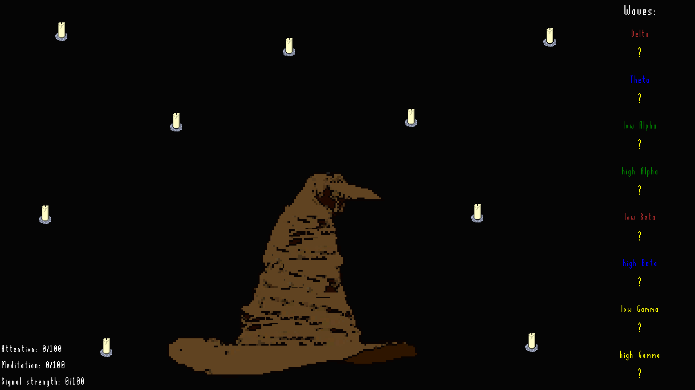
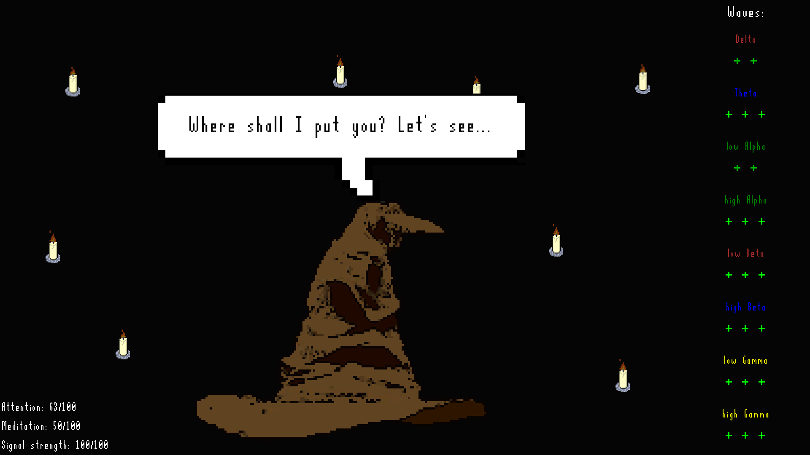
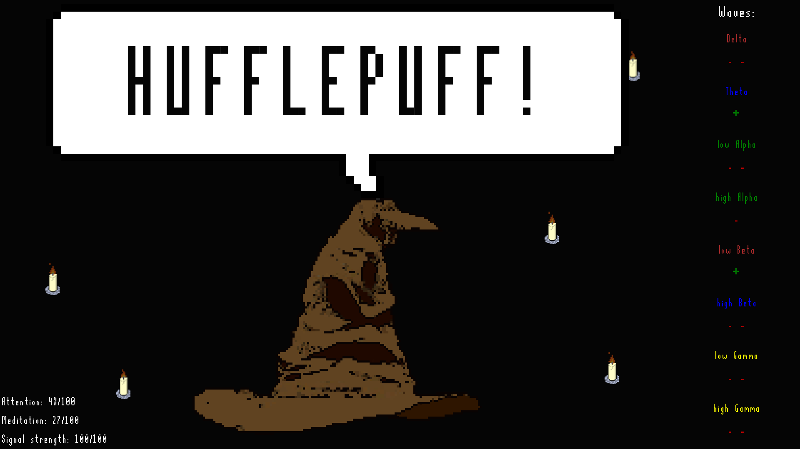

# Sorting Hat for MindWave
*Written on 8 Apr 2019*

Sorting Hat application that shows you the Hogwarts house you belong to based on your brainwave readings.

Writen in **Python**, using libraries: **socket, <a href="https://github.com/pygame/">pygame</a>, threading, datetime, random, math, os** and **winsound**.

**ThinkGear Connector** needs to be installed and running for the application to work. It was written for the old version of MindWave.

The application reads only the waves correctly transmitted (when signal is **100/100**). After getting enough brainwaves to calculate a baseline (after around **10** seconds) it will start to count points towards the houses based on if the reading of a specific brainwave is higher or lower than the overall baseline.

Brainwaves used by specific houses are color coded to that houses color:
- **Gryffindor** - Yellow 
- **Hufflepuff** - Brown 
- **Ravenclaw** - Blue 
- **Slytherin** - Green 
 
**Attention and Meditation** values impact the movement of the candles in the background (higher Attention - brigther flame, higher Meditation - slower movement).

The application works pretty consistently and usually will sort people only into one or two houses in normal circumstances. It saves all values to **Logs.txt** when a house is chosen and resets itself if right arrow is pressed or after **5** seconds of imperfect signal.

Sorting Hat was voiced by <a href="https://www.fiverr.com/philhulett">Phil Hulett</a>. **SOUND FILES AVAILABLE IN THIS PROJECT ARE NOT COVERED BY THE MIT LICENSE.**

 

  
  
  

